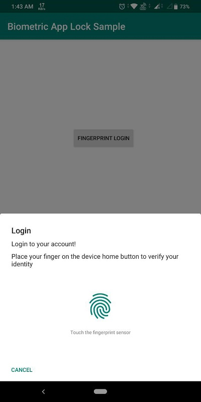

# Biometric-App-Lock
Add Biometric Authentication to any Android app</br>

This application uses android Biometric Prompt Library to authenticate user using fingerprint.





<h2>How to integrate the library in your app?</h2>
<b>Gradle Dependecy</b></br>

```gradle
dependencies {
        implementation 'androidx.biometric:biometric:1.0.0-alpha03'
}
```

<h2>Usage</h2>

```
new BiometricPrompt.PromptInfo.Builder()
                .setTitle("Login")
                .setSubtitle("Login to your account!")
                .setDescription("Place your finger on the device home button to verify your identity")
                .setNegativeButtonText("CANCEL")
                .build();
```

The ```BiometricPrompt``` class has the following callback methods:

```
new BiometricPrompt(activity, executor, new BiometricPrompt.AuthenticationCallback() {
            @Override
            public void onAuthenticationError(int errorCode, @NonNull CharSequence errString) {
                super.onAuthenticationError(errorCode, errString);
                // ................
            }

            @Override
            public void onAuthenticationSucceeded(@NonNull BiometricPrompt.AuthenticationResult result) {
                super.onAuthenticationSucceeded(result);
                // .............
            }

            @Override
            public void onAuthenticationFailed() {
                super.onAuthenticationFailed();
               // ................
            }
        });

```


